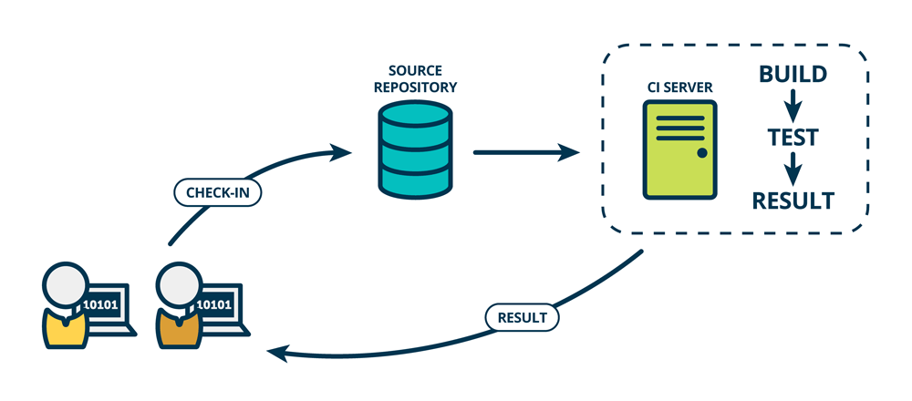

# Continuous Integration (CI)
## Problem 
- In traditional software development, the process of integration generally took place at the end of a project after each person had completed their work. Integration generally took weeks or months and could be very painful.
## Solution
- Continuous integration is a practice that puts the integration phase earlier in the development cycle so that building, testing and integrating code happens on a more regular basis.
## Continuous Integration
- Continuous integration (CI) is the practice of automating the integration of code changes from multiple contributors into a single software project.
- It’s a primary DevOps best practice, allowing developers to frequently integrate code changes into a central repository. Each integration can then be verified by an automated build and automated tests.
- One of the key benefits of integrating regularly is that you can detect errors quickly and locate them more easily. As each change introduced is typically small, pinpointing the specific change that introduced a defect can be done quickly.
- Frequent integration significantly reduce back-tracking to discover where things went wrong, so you spend less time in debugging and more time adding features.
- Helps in quick error detect, and locate them more easily.
- Continuous Integration doesn’t get rid of bugs, but it does make them dramatically easier to find and remove.
- Taking smaller steps helps us estimate more accurately and validate more frequently. Small, controlled changes are safe to happen often. And by automating all integration steps, developers avoid repetitive work and human error. Instead of having people decide when and how to run tests, a CI tool monitors the central code repository and runs all automated tests on every commit. Based on the total result of tests, it either accepts or rejects the code commit.
- A successful CI build may lead to further stages of continuous delivery.
- Summary: Integration of frequant small changes -> A testable build (end result)

